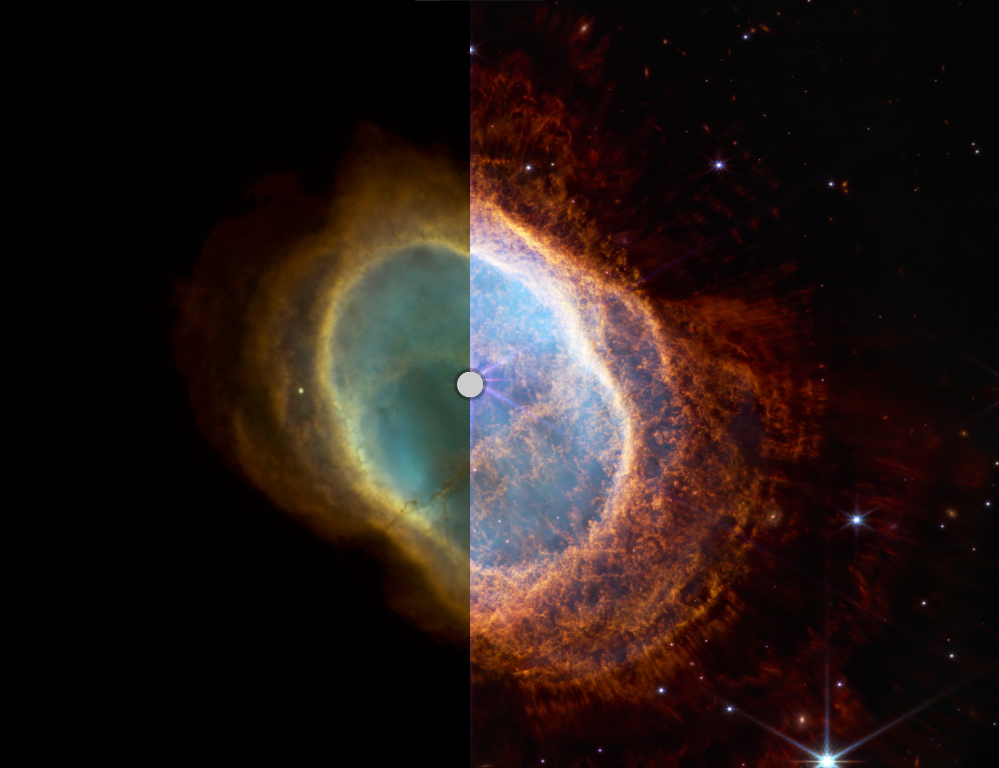

How much more powerful is the James Webb Space Telescope when compared to Hubble?

[Find out!](https://johnedchristensen.github.io/WebbCompare)

### More info

Want to help out? [CONTRIBUTING.md](CONTRIBUTING.md)

Blog post with more info about this tool: https://johnedchristensen.github.io/notes/WebbCompare/

### Resources
- Zoom and pan using OpenSeadragon https://openseadragon.github.io/
- Special thanks to Illya Moskvin for the OpenSeadragon slider implementation https://codepen.io/imoskvin/pen/yOXqvO
- Images from NASA https://www.nasa.gov/webbfirstimages